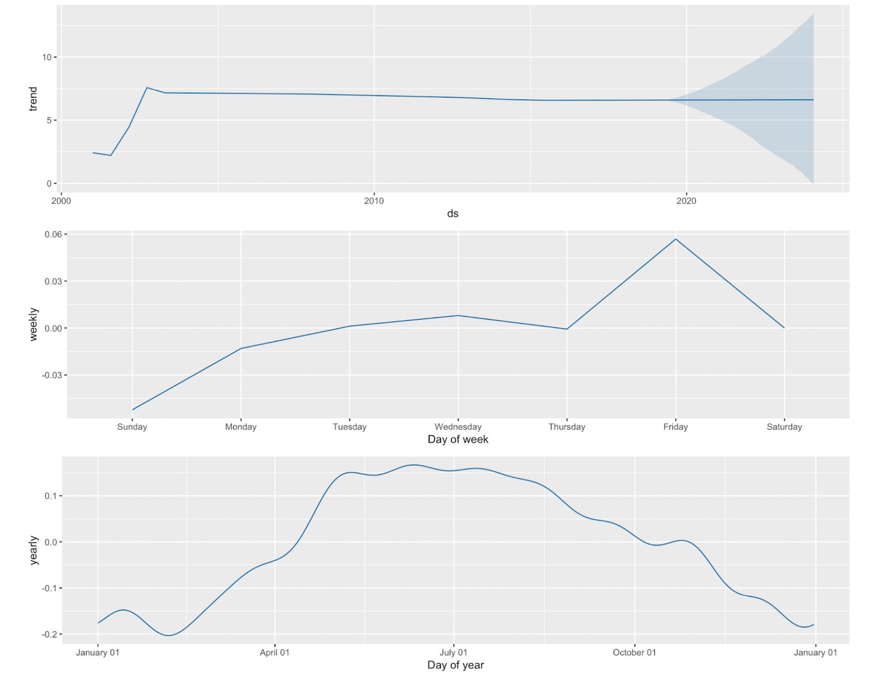

# CRIME ANALYSIS AND PREDICTION

The purpose of this project was to generate some insights on the views on crime using actual data from the Chicago Police Department. Since this is a descriptive analysis, It's approached by cleaning the data and then format it to generate insights. Mainly Visualizations were used to generate insights and forecasting.

